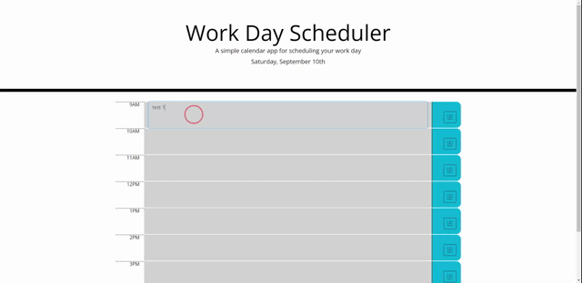

# Work-Day-Scheduler

[Live Link](https://jbrendon15.github.io/Work-Day-Scheduler/)

## Description
For this project, i had to use moment.js to add/remove classes from divs so that the background color of the textarea can be changed based on the current time (grey for past, red for present, and green for future). We also had to add functions so that the user input can be saved to localStorage and the information saved in the localStorage can be obtained to update the text in the textarea. When you reload the page the content of the text area should display what the user inputted into that text area.

## Usage

